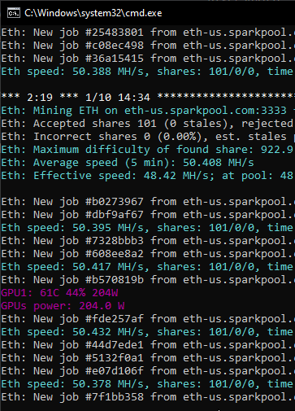
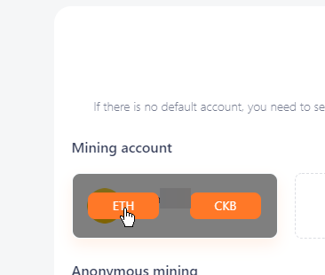
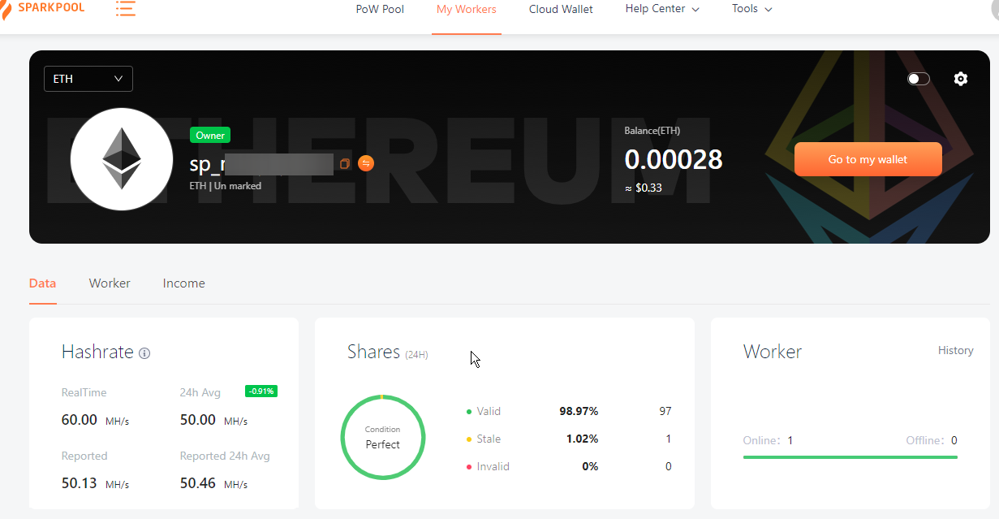

## Ethereum Mining setup guide
Quick walkthrough on getting your machine with AMD or Nvidia GPU setup to do Ethereum mining quick and easy.

### Setup
1. Create a folder in location of choice to house all of the downloaded files that will be used. 
     * \*Recommended* - Set the folder as an exclusion in any Antivirus software installed on your system.
2.  Download the PhoenixMiner software from [here](https://bit.ly/2LIpPpL)
    * not easy to spot on the site, but the zip has password protection. that password is `phoenix`
3. Extract the downloaded zip into the folder you created at the start. We'll come back to this in a moment.
4. Head over to [sparkpool](https://www.sparkpool.com/) and create a new account. This is the mining pool where the Ethereum will go. Talk to OJ if you have questions, or Google mining pools.
5. Once you've created the account and gone through all of the verification (I recommend you setup 2factor Auth as well), go to your Account Mining page from your account icon in the top right corner.
6. Once on the page, head to the SubAccount List on the left side
7. Hit Create new sub-account. This will bring you to a page to enter an account name, which will prepend with sp_. It must be all lower case and can include numbers. Be sure that it is something unique. I chose randomly generated string of characters and numbers. Once done, hit create an account. Take note of the account name you gave it, you will need it in the next step.
8. Go into the extracted files from the zip you downloaded and find the `start_mining.bat` file, right click and open in any file editor.
9. Locate the line that looks similar to this, it should be on line 12, second from the end. Feel free to copy this example below and modify accordingly.
`PhoenixMiner.exe -pool eth-us.sparkpool.com:3333 -wal sp_accountnamehere -dagrestart 1 -rvram -1 -eres 0`
    * -pool indicates the URl to the mining pool, this is already set for ethereum us pool on sparkpool.
    * -wal indicates the wallet name from sparkplug. substitute out `sp_accountnamehere` for the name of the sub account you created back in Step 7. 
10. Once the line is updated with your wallet account name, save the file and close out of the editor.
11. run `start_mining.bat`. A command window will open. You should see output similar to this

    

12. Finally, once this has run for a bit head over to Sparkpool website again. Go to My Workers at the top of the page and click it. You will come to a page with a listing of your mining accounts, mouse over your account and hit the ETH button.

    

You should come to a page that looks similar to this, listing out your hashrate stats and such. If it shows instructions on how to setup, give it a bit of time and recheck it. If after half an hour or so it stills hows those instructions you might recheck your steps or ask for help in the channel.

## Transfer to coinbase
Until you hit 0.1 ETH, you cannot transfer out any funds from Sparkpool. Once you do, you will need to transfer it to a wallet, which you will then be able to store or trade for currency.

You can setup an account on coinbase, but you will need to verify your identity in order to complete configuration. From there, you will be able to setup automatic withdrawl from your Sparkpool setup to Coinbase. I will update this guide with instructions once I do that.

## Helpful links
[whattomine.com GPU calculation page](https://whattomine.com/coins) - Allows you to select graphics cards, input anticpated power costs and get a rough calculation of money made in the course of days, weeks, or months.

[whattomine.com Eth profit calculator](https://whattomine.com/coins/151-eth-ethash) - Once you have your initial Hash rate and power consumption from starting up mining, you can use this to get a better approximation of how your rig will fair for Eth mining.